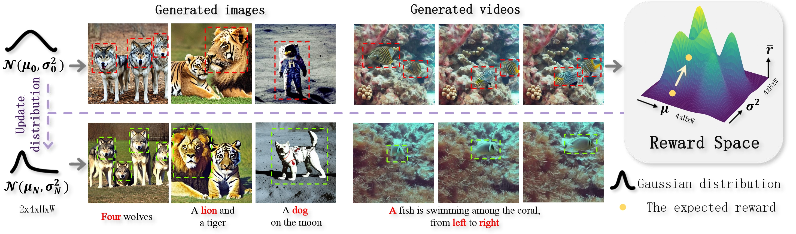

# FIND
Code for paper: FIND: Fine-tuning Initial Noise Distribution with Policy Optimization for Diffusion Models 
([Arxiv](https://arxiv.org/abs/2305.16381)) ([Website](https://vpx-ecnu.github.io/FIND-website)).


## Env Installation

Create a conda environment and install required modules.

```bash
conda env create -n find python=3.8
conda activate find
pip install -r requirements.txt
```

Install ImageReward module.

```bash
bash install_image_reward.sh
```


## Inference

```bash
python dist_train2.py --max_train_steps 150 --p_batch_size 1 --reward_weight 10 --kl_weight 0.01  --learning_rate 1e-3 --single_flag 1 --single_prompt "a green rabbit" --gradient_accumulation_steps 1 --clip_norm 0.1 --g_batch_size 1 --multi_gpu 0 --v_flag 1 --seed 99999
```

Explanation of the arguments:
- `p_batch_size`: batch size for policy training. 
- `reward_weight`: weight for the reward term in the policy loss
- `kl_weight`: weight for the KL term in the policy loss
- `learning_rate`: learning rate for the policy network
- `single_flag`: whether to train on a single prompt
- `single_prompt`: the single prompt to train on
- `gradient_accumulation_steps`: number of gradient accumulation steps
- `clip_norm`: gradient clipping norm
- `g_batch_size`: batch size for generation. Batch size 12 can be used for a single A100 GPU.
- `multi_gpu`: whether to use multiple GPUs.
- `v_flag`: whether to use value learning.


## Bibtex
```bash
@inproceedings{chen2024find,
      title={FIND: Fine-tuning Initial Noise Distribution with Policy Optimization for Diffusion Models},
      author={Chen, Changgu and Yang, Libing and Yang, Xiaoyan and Chen, Lianggangxu and He, Gaoqi and Wang, Changbo and Li, Yang},
      booktitle={ACM Multimedia 2024}
    }
```